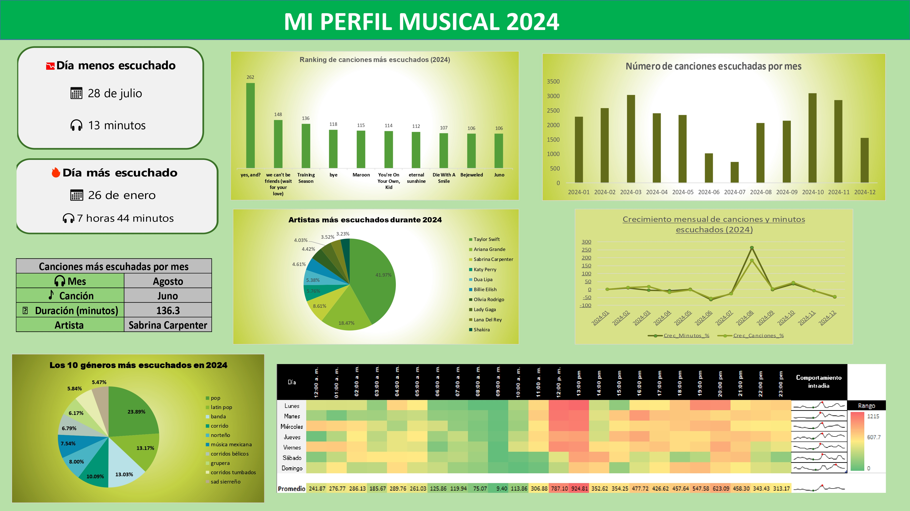

# Spotify Streaming History Analysis 

<p align="center">
  
</p>

## Project Overview

**How can raw Spotify streaming data be transformed into meaningful insights using Python and data visualization?**

This project analyzes a personal Spotify Extended Streaming History dataset corresponding to 2024. The original listening history was requested directly from Spotify and provided as raw JSON files. These files were cleaned, transformed, and consolidated into a structured CSV dataset using Python, enabling further statistical analysis and visualization.

The project implements a complete data analysis workflow, including:

- Data extraction and preprocessing from raw JSON files.
- Data cleaning and transformation using **Pandas**.
- Descriptive statistical analysis of listening behavior.
- Genre enrichment through the **Spotify Web API**.
- Data visualization with **Matplotlib** and **Seaborn**.
- Development of an interactive dashboard in **Microsoft Excel** using Pivot Tables, Pivot Charts, and conditional formatting.

Rather than focusing only on music preferences, the main objective of this project is to demonstrate an end-to-end data analysis pipeline. Starting from raw data, the project produces structured datasets, statistical summaries, visualizations, and an interactive dashboard that provide meaningful insights into listening behavior throughout 2024.

---

## Project Objectives

- Transform raw Spotify JSON files into a structured dataset suitable for analysis.
- Perform descriptive statistical analysis of listening activity during 2024.
- Identify listening patterns across songs, artists, albums, genres, and time.
- Generate clear visualizations to communicate the results.
- Build an interactive dashboard that summarizes the main findings.
- Demonstrate practical skills in data cleaning, data analysis, visualization, and API integration using Python.

## Dataset

The dataset used in this project was obtained by requesting a personal Spotify Extended Streaming History through Spotify's data export service.

Although the exported archive contains listening records spanning multiple years, this project focuses exclusively on listening activity during **2024**.

The original data were provided as multiple JSON files containing detailed information about each playback event, including:

- Timestamp (`ts`)
- Track name
- Artist name
- Album name
- Playback duration (`ms_played`)
- Platform
- Shuffle status
- Skip status
- Offline playback information
- Additional playback metadata

During the preprocessing stage, all JSON files were merged into a single dataset, filtered to retain only records from 2024, cleaned, and exported as a structured CSV file for subsequent analysis.

## Project Workflow

The project is organized into four main stages:

1. **Data Cleaning**
   - Load the raw JSON files exported by Spotify.
   - Merge all listening records into a single dataset.
   - Filter the data to include only records from 2024.
   - Handle missing values and export the cleaned dataset as a CSV file.

2. **Descriptive Statistics**
   - Compute the most played songs, artists, and albums.
   - Calculate total listening time.
   - Analyze monthly listening activity.
   - Generate statistical reports in Excel format.

3. **Genre Analysis**
   - Retrieve artist genres using the Spotify Web API.
   - Identify the most listened-to genres for each month.

4. **Data Visualization**
   - Create bar charts, line charts, and heatmaps.
   - Generate monthly summary cards.
   - Build the final interactive dashboard in Microsoft Excel.

## Repository Structure

```text
spotify-streaming-history-analysis/
|
|--- data/
|   |--- raw/
|   |--- processed/
|
|--- scripts/
|   |--- 01_clean_data.py
|   |--- 02_basic_statistics.py
|   |--- 03_genre_analysis.py
|   |---- 04_visualizations.py
|
|--- results/
|--- figures/
|--- dashboard/
|---- docs/
|
|--- requirements.txt
|---- README.md
```

## Technologies Used

- Python
- Pandas
- NumPy
- Matplotlib
- Seaborn
- Spotipy (Spotify Web API)
- OpenPyXL
- Microsoft Excel
- Git
- GitHub

## Results

The project generates several outputs that summarize listening behavior during 2024, including:

- Top 20 most played songs.
- Top artists.
- Top albums.
- Monthly listening activity.
- Total listening time.
- Daily listening summaries.
- Monthly genre analysis using the Spotify Web API.
- Monthly listening trends.
- Listening heatmap by weekday and hour.
- Monthly summary cards.
- Interactive Excel dashboard.

## Dashboard

The final dashboard was developed in **Microsoft Excel** using Pivot Tables, Pivot Charts, Conditional Formatting, and interactive filters.

It summarizes the most relevant statistics generated throughout the analysis pipeline, allowing users to explore listening behavior during 2024 through an intuitive visual interface.

## How to Run

1. Clone this repository.

```bash
git clone https://github.com/your-username/spotify-streaming-history-analysis.git
```

2. Install the required libraries.

```bash
pip install -r requirements.txt
```

3. Execute the scripts in the following order:

```text
01_clean_data.py
02_basic_statistics.py
03_genre_analysis.py
04_visualizations.py
```

## Author

**Karim Yahir Vallejo Flores**

Physics Graduate — National Autonomous University of Mexico (UNAM)

This project was developed as part of my professional portfolio to demonstrate practical skills in data cleaning, statistical analysis, data visualization, API integration, and workflow organization using Python.
